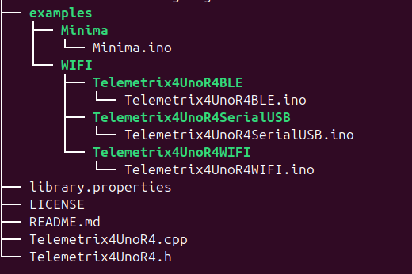
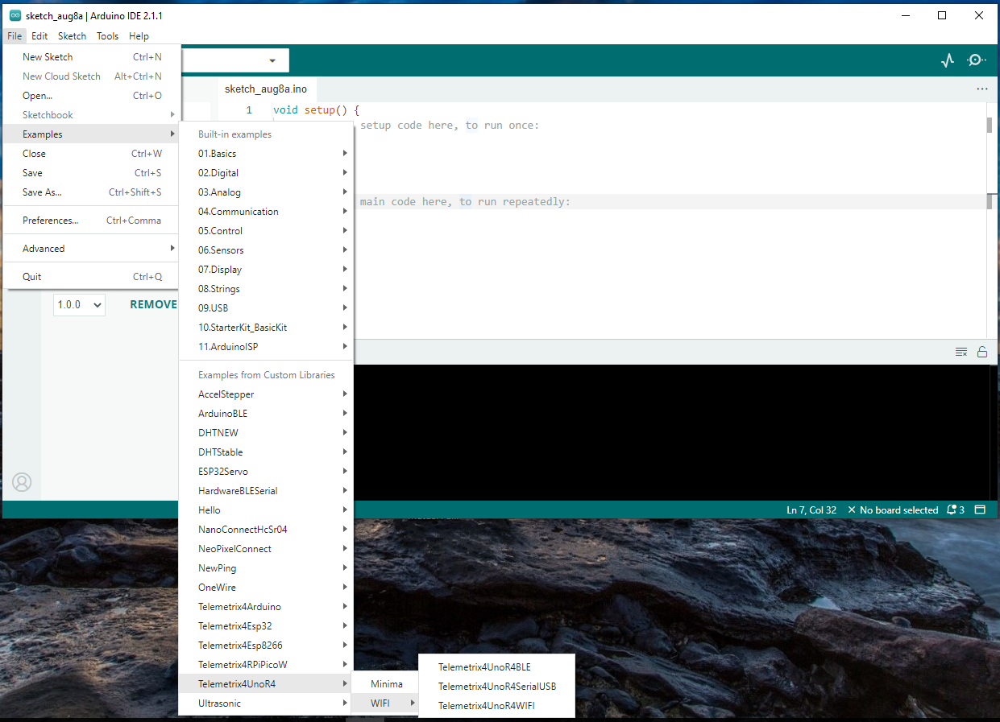

{ width="450" }


Over the past few years, I've been developing the 
Telemetrix family of libraries. These libraries, 
designed to facilitate microcontroller programming, allow you to 
control and monitor a variety of microcontrollers through a 
standardized set of Python3 client APIs and associated microcontroller 
servers written in C++.

<!-- more -->
The Telemetrix architecture, with its simplicity and consistency, 
is highly extensible. It empowers you to easily add new functionality and 
support for future microprocessors and hardware devices, giving you complete 
control over your development process.

Except for the Raspberry Pi Pico, the servers are all written using
Arduino Cores as their basis. 
An Arduino Core contains all the software and tools to provide a software 
abstraction 
layer for a particular processor. 
It includes various tools, like the gcc compiler tools, to 
compile and link  the code.
Using Arduino Cores allows for a high degree of commonality between 
the servers, simplifies adding support for a new microprocessor, and allows for 
integrating additional Arduino device libraries.

The client APIs are designed to focus on efficiency
and productivity, sharing many standard features.
This makes porting code written from one microprocessor
to another a breeze, saving time and effort.

Currently, Telemetrix supports the:

* [Arduino ATMega boards(UNO, Leonardo, Mega2560)](https://mryslab.github.io/telemetrix/)
* [Arduino UNO R4 Minima and WIFI](https://mryslab.github.io/telemetrix-uno-r4/)
* [Arduino Nano RP2040 Connect ](https://mryslab.github.io/telemetrix-nano-2040-wifi/)
* [ESP8266](https://mryslab.github.io/telemetrix/)
* [ESP32](https://mryslab.github.io/telemetrix-esp32/)
* [Raspberry Pi Pico (Raspberry Pi C++ SDK-based)](https://mryslab.github.io/telemetrix-rpi-pico/)
* [Raspberry Pi Pico-W](https://mryslab.github.io/telemetrix-rpi-pico-w/)
* [STM32 Boards (i.e. Blackpill)](https://mryslab.github.io/telemetrix/)

To uncover Telemetrix internals, we will be exploring:

* Telemetrix Server File Layout
* Telemetrix Client File Layout
* Telemetrix Command And Message Structure.
* Telemetrix Concurrency
* Adding Support For The [MobaTools Stepper Library](https://github.com/MicroBahner/MobaTools)

In the next post we will explore the Telemetrix server file layout.

# Telemetrix Server File Layout

All Telemetrix servers use a very similar file layout. Let's begin by exploring the code 
for a typical Telemetrix server. For 
discussion 
purposes, we
will be using the server built for the
[Arduino UNO R4 Minima](https://github.com/MrYsLab/Telemetrix4UnoR4/blob/master/examples/Minima/Minima.ino).


A Telemetrix server is a "fixed" Arduino sketch uploaded to a microcontroller.
The server code is considered "fixed" in that it is uploaded to the microcontroller
and is left unchanged. "Programming" of the microcontroller is performed by the 
user writing a Python
script constructed from a [Telemetrix Python API](https://mryslab.github.io/telemetrix-uno-r4/telemetrix_wifi_reference/).

The only time the server sketch is modified is to add functionality or when it is
first created to support a new microcontroller.

Now let's explore the code.

## Telemetrix Server Code Sections


All Telemetrix servers are [implemented using the following common sections](https://github.com/MrYsLab/Telemetrix4UnoR4/blob/3629992d2c64da9b76eb5771d4c8933678149924/examples/Minima/Minima.ino#L19):

1. [Feature Enabling Defines](#feature-enabling-defines)
2. [Arduino ID](#arduino-id)
3. [Client Command Related Defines and Support](#client-command-related-defines-and-support)
4. [Server Report Related Defines](#server-report-related-defines)
5. [i2c Related Defines](#i2c-related-defines)
6. [Pin Related Defines And Data Structures](#pin-related-defines-and-data-structures)
7. [Feature Related Defines, Data Structures and Storage Allocation](#feature-related-defines-data-structures-and-storage-allocation)
8. [Command Functions](#command-functions)
9. [Scanning Inputs, Generating Reports And Running Steppers](#scanning-inputs-generating-reports-and-running-steppers)
10. [Setup and Loop](#setup-and-loop)

**When discussing these sections, both code snippets and links to the
code will be used.**

### Feature Enabling Defines

It is sometimes handy to be able to disable a built-in feature. When 
debugging a modified server, you may wish to disable certain features.

Or perhaps, the current size of the server code is limiting adding a new
feature. You can limit the server's foot print by removing support for
unneeded features.

A typical set of server features include:

* Support SPI device communication.
* Support for i2c device communication.
* Support for 1-Wire device communication.
* Support for servo motors.
* Support for stepper motors.
* Support for HC-SR04 type ultrasonic distance sensors.
* Support for DHT type temperature/humidity sensors.

Let's look at the [feature enabling defines](https://github.com/MrYsLab/Telemetrix4UnoR4/blob/3629992d2c64da9b76eb5771d4c8933678149924/examples/Minima/Minima.ino#L35).

```aiignore
/* %%%%%%%%%%%%%%%%%%%%%%%%%%%%%%%%%%%%%%%%%%%%%%%%%%%%%%%%%%%%%%%%%*/
/*                    FEATURE ENABLING DEFINES                      */
/* %%%%%%%%%%%%%%%%%%%%%%%%%%%%%%%%%%%%%%%%%%%%%%%%%%%%%%%%%%%%%%%%%*/


// To disable a feature, comment out the desired enabling define or defines

// This will allow SPI support to be compiled into the sketch.
// Comment this out to save sketch space for the UNO
#define SPI_ENABLED 1

// This will allow OneWire support to be compiled into the sketch.
// Comment this out to save sketch space for the UNO
#define ONE_WIRE_ENABLED 1

// This will allow DHT support to be compiled into the sketch.
// Comment this out to save sketch space for the UNO
#define DHT_ENABLED 1

// This will allow sonar support to be compiled into the sketch.
// Comment this out to save sketch space for the UNO
#define SONAR_ENABLED 1

// This will allow servo support to be compiled into the sketch.
// Comment this out to save sketch space for the UNO
#define SERVO_ENABLED 1

// This will allow stepper support to be compiled into the sketch.
// Comment this out to save sketch space for the UNO

// Accelstepper is currently not compatible with the UNO R4 Minima
// #define STEPPERS_ENABLED 1

// This will allow I2C support to be compiled into the sketch.
// Comment this out to save sketch space for the UNO
#define I2C_ENABLED 1

```
All the features are enabled for the UNO R4 Minima, with the exception of stepper
motor support. The define for this feature is commented out. The reason for this
is the AccelStepper library used to implement this feature, does 
not yet function with Arduino UNO R4 boards. 

In a future article, we will implement the feature using a differnt stepper motor
library.
We use the feature defines to conditionally 
[include the required header files](https://github.com/MrYsLab/Telemetrix4UnoR4/blob/3629992d2c64da9b76eb5771d4c8933678149924/examples/Minima/Minima.ino#L74) for
the feature support libraries.

```aiignore
#ifdef SERVO_ENABLED
#include <Servo.h>
#endif

#ifdef SONAR_ENABLED
#include <NewPing.h>
#endif

#ifdef I2C_ENABLED
#include <Wire.h>
#endif

#ifdef DHT_ENABLED
#include <DHTStable.h>
#endif

#ifdef SPI_ENABLED
#include <SPI.h>
#endif

#ifdef ONE_WIRE_ENABLED
#include <OneWire.h>
#endif

#ifdef STEPPERS_ENABLED
#include <AccelStepper.h>
#endif

```

### Arduino ID
For microcontrollers that use a Serial/USB data transport, Telemetrix defaults to 
using an auto-discovery scheme, to find the COM port that the microcontroller is
connected to. 

You may also manually specify the COM port in your application, but this is not
always effective, since the COM port assignment by the operating system may 
dynamically change from run to run.

The Arduino ID helps to identify the COM port in use by a specific microcontroller.

```aiignore
/* %%%%%%%%%%%%%%%%%%%%%%%%%%%%%%%%%%%%%%%%%%%%%%%%%%%%%%%%%%%%%%%%%*/
/*                    Arduino ID                      */
/* %%%%%%%%%%%%%%%%%%%%%%%%%%%%%%%%%%%%%%%%%%%%%%%%%%%%%%%%%%%%%%%%%*/

// This value must be the same as specified when instantiating the
// telemetrix client. The client defaults to a value of 1.
// This value is used for the client to auto-discover and to
// connect to a specific board regardless of the current com port
// it is currently connected to.

#define ARDUINO_ID 1
```

### Client Command Related Defines and Support
For each command that the server supports, a command ID is defined.
[For the Arduino UNO R4 Minima](https://github.com/MrYsLab/Telemetrix4UnoR4/blob/3629992d2c64da9b76eb5771d4c8933678149924/examples/Minima/Minima.ino#L119), 
there are 58 commands defined.

Each command has an associated function used to process the command.
Each command handler is initially specified using [forward referencing](https://github.com/MrYsLab/Telemetrix4UnoR4/blob/3629992d2c64da9b76eb5771d4c8933678149924/examples/Minima/Minima.ino#L188),
to simplify
compilation. The actual handlers are defined further down the file. By using forward
referencing, a [command table](https://github.com/MrYsLab/Telemetrix4UnoR4/blob/3629992d2c64da9b76eb5771d4c8933678149924/examples/Minima/Minima.ino#L324), 
consisting of an array of pointers to the command 
functions, can
be built at the top of the file.

**_IMPORTANT NOTE:_**

**The Command IDs serve as an index into the command table. Therefore, when adding a
new command, add a new ID at the bottom of the command defines.**


### Server Report Related Defines

A server report transmits information, such an input value change, or perhaps a reply 
to a client informational request.

Each report contains a report ID. These IDs are defined
[here](https://github.com/MrYsLab/Telemetrix4UnoR4/blob/3629992d2c64da9b76eb5771d4c8933678149924/examples/Minima/Minima.ino#L398).

When adding an ID for a new report, add it before DEBUG_PRINT_REPORT. 

```aiignore
// Reports sent to the client

#define DIGITAL_REPORT DIGITAL_WRITE
#define ANALOG_REPORT ANALOG_WRITE
#define FIRMWARE_REPORT 5
#define I_AM_HERE 6
#define SERVO_UNAVAILABLE 7
#define I2C_TOO_FEW_BYTES_RCVD 8
#define I2C_TOO_MANY_BYTES_RCVD 9
#define I2C_READ_REPORT 10
#define SONAR_DISTANCE 11
#define DHT_REPORT 12
#define SPI_REPORT 13
#define ONE_WIRE_REPORT 14
#define STEPPER_DISTANCE_TO_GO 15
#define STEPPER_TARGET_POSITION 16
#define STEPPER_CURRENT_POSITION 17
#define STEPPER_RUNNING_REPORT 18
#define STEPPER_RUN_COMPLETE_REPORT 19
#define FEATURES 20
#define DEBUG_PRINT 99
```

For example, if we want to create a new report called NEW_REPORT, we would
add it after the FEATURES report and NEW_REPORT would be assigned an ID of 21.

```aiignore
#define STEPPER_RUNNING_REPORT 18
#define STEPPER_RUN_COMPLETE_REPORT 19
#define FEATURES 20
#define NEW_REPORT 21  // The newly added report
#define DEBUG_PRINT 99
```

### I2C Related Defines
This [section](https://github.com/MrYsLab/Telemetrix4UnoR4/blob/3629992d2c64da9b76eb5771d4c8933678149924/examples/Minima/Minima.ino#L485) 
contains defines used for managing i2c ports. It specifies 
the i2c SDA and SCL pins.

```aiignore
/* %%%%%%%%%%%%%%%%%%%%%%%%%%%%%%%%%%%%%%%%%%%%%%%%%%%%%%%%%%%%%%%%%*/
/*                     i2c Related Defines*/
/* %%%%%%%%%%%%%%%%%%%%%%%%%%%%%%%%%%%%%%%%%%%%%%%%%%%%%%%%%%%%%%%%%*/

/**********************************/
/* i2c defines */

#ifdef I2C_ENABLED
// uncomment out the next line to create a 2nd i2c port
// #define SECOND_I2C_PORT

#ifdef SECOND_I2C_PORT
// Change the pins to match SDA and SCL for your board
#define SECOND_I2C_PORT_SDA PB3
#define SECOND_I2C_PORT_SCL PB10

TwoWire Wire2(SECOND_I2C_PORT_SDA, SECOND_I2C_PORT_SCL);
#endif

// a pointer to an active TwoWire object
TwoWire *current_i2c_port;
#endif
```

### Pin Related Defines And Data Structures
This [section](https://github.com/MrYsLab/Telemetrix4UnoR4/blob/3629992d2c64da9b76eb5771d4c8933678149924/examples/Minima/Minima.ino#L509)
contains the definitions for arrays of pin descriptors for both analog and 
digital pins.

Each pin descriptor contains information such as the pin number, if its mode is
input or output, whether the pin is enabled to generate a report, and the last
value reported.

```aiignore
// maximum number of pins supported
#define MAX_DIGITAL_PINS_SUPPORTED 14
#define MAX_ANALOG_PINS_SUPPORTED 6


// Analog input pins are defined from
// A0 - A5.


// To translate a pin number from an integer value to its analog pin number
// equivalent, this array is used to look up the value to use for the pin.
int analog_read_pins[6] = {A0, A1, A2, A3, A4, A5};


// a descriptor for digital pins
struct pin_descriptor
{
    byte pin_number;
    byte pin_mode;
    bool reporting_enabled; // If true, then send reports if an input pin
    int last_value;         // Last value read for input mode
};

// an array of digital_pin_descriptors
pin_descriptor the_digital_pins[MAX_DIGITAL_PINS_SUPPORTED];

```
### Feature Related Defines, Data Structures and Storage Allocation

This [section of code](https://github.com/MrYsLab/Telemetrix4UnoR4/blob/3629992d2c64da9b76eb5771d4c8933678149924/examples/Minima/Minima.ino#L567)
contains the code to manage features such as servos, DHT tempertaure/humidity
devices, sonar distance sensors, stepper motors, and onewire devices.

```aiignore
/* %%%%%%%%%%%%%%%%%%%%%%%%%%%%%%%%%%%%%%%%%%%%%%%%%%%%%%%%%%%%%%%%%*/
/*  Feature Related Defines, Data Structures and Storage Allocation */
/* %%%%%%%%%%%%%%%%%%%%%%%%%%%%%%%%%%%%%%%%%%%%%%%%%%%%%%%%%%%%%%%%%*/

// servo management
#ifdef SERVO_ENABLED
Servo servos[MAX_SERVOS];

// this array allows us to retrieve the servo object
// associated with a specific pin number
byte pin_to_servo_index_map[MAX_SERVOS];
#endif

// HC-SR04 Sonar Management
#define MAX_SONARS 6

#ifdef SONAR_ENABLED
struct Sonar
{
    uint8_t trigger_pin;
    unsigned int last_value;
    NewPing *usonic;
};

// an array of sonar objects
Sonar sonars[MAX_SONARS];

byte sonars_index = 0; // index into sonars struct

// used for scanning the sonar devices.
byte last_sonar_visited = 0;
#endif //SONAR_ENABLED

unsigned long sonar_current_millis;  // for analog input loop
unsigned long sonar_previous_millis; // for analog input loop

#ifdef SONAR_ENABLED
uint8_t sonar_scan_interval = 33;    // Milliseconds between sensor pings
// (29ms is about the min to avoid = 19;
#endif

// DHT Management
#define MAX_DHTS 6                // max number of devices
#define READ_FAILED_IN_SCANNER 0  // read request failed when scanning
#define READ_IN_FAILED_IN_SETUP 1 // read request failed when initially setting up

#ifdef DHT_ENABLED
struct DHT
{
    uint8_t pin;
    uint8_t dht_type;
    unsigned int last_value;
    DHTStable *dht_sensor;
};

// an array of dht objects
DHT dhts[MAX_DHTS];

byte dht_index = 0; // index into dht struct

unsigned long dht_current_millis;      // for analog input loop
unsigned long dht_previous_millis;     // for analog input loop
unsigned int dht_scan_interval = 2000; // scan dht's every 2 seconds
#endif // DHT_ENABLED


/* OneWire Object*/

// a pointer to a OneWire object
#ifdef ONE_WIRE_ENABLED
OneWire *ow = NULL;
#endif

#define MAX_NUMBER_OF_STEPPERS 4

// stepper motor data
#ifdef STEPPERS_ENABLED
AccelStepper *steppers[MAX_NUMBER_OF_STEPPERS];

// stepper run modes
uint8_t stepper_run_modes[MAX_NUMBER_OF_STEPPERS];
#endif

### 
```

### Command Functions

This [section of code](https://github.com/MrYsLab/Telemetrix4UnoR4/blob/3629992d2c64da9b76eb5771d4c8933678149924/examples/Minima/Minima.ino#L651) 
contains the implementations of the command handlers.

Each handler dereferences the data specific to each command.

Let's look at the handler for a digital write.

```aiignore
void digital_write()
{
    byte pin;
    byte value;
    pin = command_buffer[0];
    value = command_buffer[1];
    digitalWrite(pin, value);
}
```
The command buffer contains the information sent from the client. This includes the
pin number and the requested value for that pin.

The Arduino Core digital write command, digitalWrite,  is called using the
information sent from the client.

### Scanning Inputs, Generating Reports And Running Steppers

### Setup and Loop


A Telemetrix application consists of a server resident on a microcontroller, 
and a Python client resident on a PC.

Let's begin by exploring the code for a typical Telemetrix server. For discussion 
purposes, we
will be using the server built for the
[Arduino UNO R4 Minima](https://store.arduino.cc/products/uno-r4-minima).

## The Telemetrix4UnoR4


## The Telemetrix Server File Tree

To create an Arduino compatible library, that is, one that may be published to
the Arduino Library Manager, and loaded into the Arduino IDE, one must create and
layout the library's file in a very specific format.



Looking at any existing Telemetrix server, the only files we need to 
concern ourselves 
with are:

* [library.properties](https://arduino.github.io/arduino-cli/1.1/library-specification/#15-library-format-rev-22) - it contains the library metadata.
* The files in the _examples_ directory which are the actual servers.

All other files are left untouched.

## Selecting A Server In The Arduino IDE



After loading a Telemetrix library into the Arduino IDE, we can select a server
by selecting File/Example/_Library Name_ from the Arduino IDE main menu. Since we
will looking at the server the Arduino UNO R4 Minima, that is the example we will 
select.

In this screenshot, 
The files 
Arduino has 

The client application is written in Python using an API specifically designed
to work with its related server. Here is
[the API](https://htmlpreview.github.io/?https://github.com/MrYsLab/telemetrix/blob/master/html/telemetrix/index.html)
for Arduino AVR processors.

The server is a fixed code set specific to each microcontroller type. Here is the
[server for Arduino AVR Processors](https://github.com/MrYsLab/Telemetrix4Arduino/blob/master/examples/Telemetrix4Arduino/Telemetrix4Arduino.ino).


# Understanding Telemetrix Messaging Structure


The same message structure is used for both command and report messages.

Telemetrix messages are constructed from bytes and are variable in length.

A message frame consists of the number of bytes contained in the frame payload, the 
command or 
report message ID, and the command or report data.

# A Quick Look At The Client API and Server Source Files


# Extending Telemetrix Capabilities
To extend the capabilities of a Telemetrix release, one needs to understand
Telemetrix message structure and 

## Telemetrix Messaging


Telemetrix messages sent from a Python client implementing a Telemetrix API are 
referred 
to as command 
messages.
For example, if you wish to command an microcontroller pin to act as a digital input,
the Python client application would call the 
[_set_pin_mode_digital_input_](https://htmlpreview.github.io/?https://github.com/MrYsLab/telemetrix/blob/master/html/telemetrix/index.html#telemetrix.telemetrix.Telemetrix.set_pin_mode_digital_input) method.

This method requires two parameters. The first is a valid pin number of the pin we
would like to monitor for changes. The second is a Python user 
written callback function.


that 
is 

# Looking At Telemetrix Internals

Using the command to set a pin to Analog input mode, we will explore Telemetrix
messaging between the client and server.

This series is for you if you would like
to extend a Telemetrix library with support for a
new device or wish to understand the inner workings of Telemetrix,
including its architecture, message formats,  and communication protocols.

We will add stepper motor support for the Arduino UNO R4 WIFI using the
[MobaTools](https://github.com/MicroBahner/MobaTools) library for this discussion.

Because all versions of Telemetrix are very similar,
you will also learn to create your own Telemetrix device
extensions or provide support for a new microprocessor.

# Telemetrix At 10000 Kilometers


This image depicts a typical Telemetrix setup.
A PC runs a Python client application, which communicates with a
microcontroller and has a Telemetrix server installed.
The client and server communicate via messaging, transmitting
over a Serial USB, WIFI, or Bluetooth transport specific to the microcontroller.


# Following A Command And Report End-to-end
To better understand the Telemetrix underpinnings, 
let's trace what happens when the set_pin_mode_digital_input is called.

# Understanding Telemetrix Messages
Messages sent from the client to the server are called 
command messages. For example, you may command a GPIO pin to 
go HIGH to turn on an LED, or you may wish to command 
the microcontroller to continuously monitor an analog input pin. 
When reporting data changes, the microcontroller constructs a report 
message that the client will interrupt.

Telemetrix messages are constructed from bytes and are variable in length.

A message frame consists of the number of bytes contained in the frame, the command or 
report message ID, and the command or report data.


## Exploring The set_pin_mode_input Command Message


The contents of a command frame to set pin 12 as a digital input are shown above.
Let's explore each byte and see how it was populated.
Here are some of the topics that will be discussed.

* Messaging formats between the client and server.
* File organization for both client and server.
* Considerations for adding new functionality.


