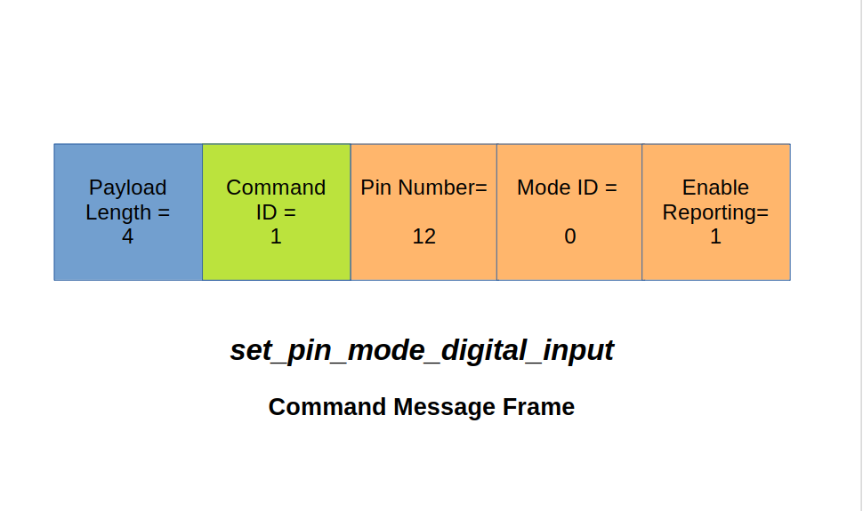

{ width="450" }

Over the past few years, I've been developing the 
Telemetrix family of libraries. These libraries, 
designed to facilitate microcontroller programming, allow you to 
control and monitor a variety of microcontrollers through a 
standardized set of Python3  client APIs and their associated servers that
are microcontroller resident.

The Telemetrix architecture is not just simple and consistent, 
but also highly extensible. It empowers you to easily add new functionality
and support for future microprocessors and hardware devices, 
giving you full control over your development process.

Except for the Raspberry Pi Pico, the servers are all written using
Arduino Cores as their basis. This allows for a high degree of commonality between 
the servers, simplifies adding support for a new microprocessor, and allows for 
integrating Arduino device libraries.

The client APIs are designed with a focus on 
efficiency and productivity, sharing many common features. 
This makes it a breeze to port code written for one microprocessor 
to another, saving you time and effort.

Currently, Telemetrix supports the:

* [Arduino ATMega boards(UNO, Leonardo, Mega2560)](https://mryslab.github.io/telemetrix/)
* [Arduino UNO R4 Minima and WIFI](https://mryslab.github.io/telemetrix-uno-r4/)
* [Arduino Nano RP2040 Connect ](https://mryslab.github.io/telemetrix-nano-2040-wifi/)
* [ESP8266](https://mryslab.github.io/telemetrix/)
* [ESP32](https://mryslab.github.io/telemetrix-esp32/)
* [Raspberry Pi Pico (Raspberry Pi C++ SDK-based)](https://mryslab.github.io/telemetrix-rpi-pico/)
* [Raspberry Pi Pico-W](https://mryslab.github.io/telemetrix-rpi-pico-w/)
* [STM32 Boards (i.e. Blackpill)](https://mryslab.github.io/telemetrix/)

# Who Is This Series For?

This series is for you if you would like
to extend a Telemetrix library with support for a
new device or wish to understand the inner workings of Telemetrix,
including its architecture, message formats,  and communication protocols.

We will add stepper motor support for the Arduino UNO R4 WIFI using the
[MobaTools](https://github.com/MicroBahner/MobaTools) library for this discussion.

Because all versions of Telemetrix are very similar,
you will also learn to create your own Telemetrix device
extensions or provide support for a new microprocessor.

# Telemetrix At 10000 Kilometers

This image depicts a typical Telemetrix setup.
A PC runs a Python client application, which communicates with a
microcontroller and has a Telemetrix server installed.
The client and server communicate via messaging, transmitting
over a Serial USB, WIFI, or Bluetooth transport specific to the microcontroller.

# Following A Command And Report End-to-end
To better understand the Telemetrix underpinnings, 
let's trace what happens when the set_pin_mode_digital_input is called.

# Understanding Telemetrix Messages
Messages sent from the client to the server are called 
command messages. For example, you may command a GPIO pin to 
go HIGH to turn on an LED, or you may wish to command 
the microcontroller to continuously monitor an analog input pin. 
When reporting data changes, the microcontroller constructs a report 
message that the client will interrupt.

Telemetrix messages are constructed from bytes and are variable in length.

A message frame consists of the number of bytes contained in the frame, the command or 
report message ID, and the command or report data.

## Exploring The set_pin_mode_input Command Message

The contents of a command frame to set pin 12 as a digital input are shown above.
Let's explore each byte and see how it was populated.
Here are some of the topics that will be discussed.

* Messaging formats between the client and server.
* File organization for both client and server.
* Considerations for adding new functionality.

