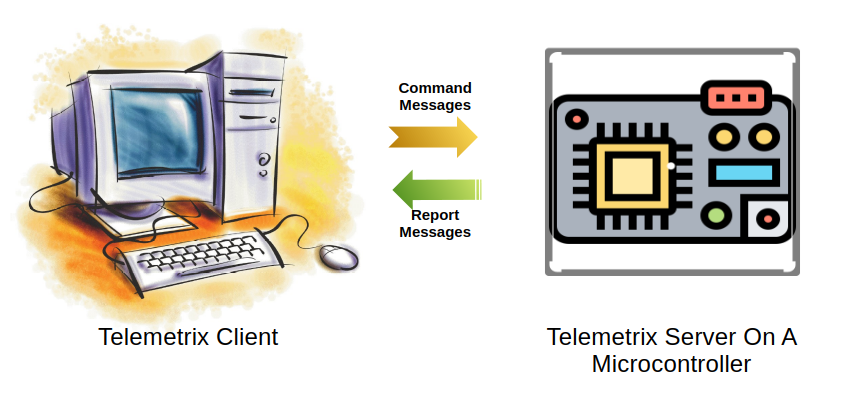
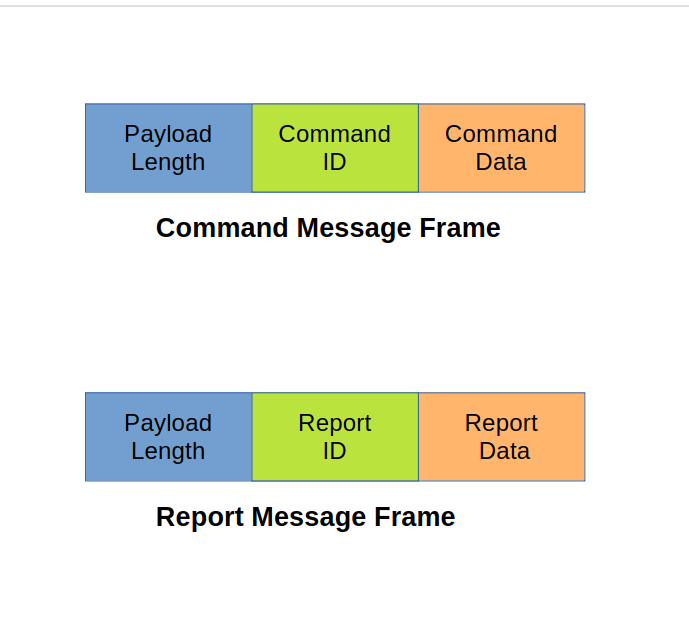

# Telemetrix Under The Hood Part 2


## Understanding Telemetrix Messaging



A Telemetrix Python client and a Telemetrix microprocessor-resident server communicate
by exchanging messages over a data transport link. 

The type of transport link that is used is dependent upon the capabilities
of the server hardware.

For example, this is a serial/USB link for the Arduino UNO R4 Minima. 
For the Arduino UNO R4 WIFI, Serial/USB, WIFI, and BLE links are supported.

Message creation, interpretation, and transfer are performed behind 
the scenes and are hidden from the application developer. Therefore, 
when creating your application, you need not be concerned with internal messaging details.

However, if you wish to extend Telemetrix's functionality, 
you will need to understand the details of Telemetrix messaging.

This posting will look at the two message types and their formats.

<!-- more -->


In subsequent postings, we will investigate the details of 
message creation, interpretation, and transference.


### Message Types

#### Command Messages

_Command messages_ are sent from the client application to the server to 
request that the server take action on the client's behalf. For example, 
you may set a digital output pin to the HIGH state.
When writing a Telemetrix Python client application, the application 
calls
[digital_write](https://mryslab.github.io/telemetrix-uno-r4/telemetrix_minima_reference/#telemetrix_uno_r4_minima.TelemetrixUnoR4Minima.digital_write),
and the API code will form and transfer the message to perform the request.

#### Report Messages
_Report messages_ are sent from the server to the client. For example, 
the server forms a report message whenever a digital input pin changes state.  
It autonomously sends the report message over the data transport to the 
client application for processing by the pin's associated callback function.


### Message Format





Both command and report messages use identical variable-length message formats. 

A message consists of three components:

* Packet length
* Message ID
* Message Data


#### Packet Length

The packet length is the number of bytes in the message, not including the
packet length.

The packet length is one byte in length.

#### Message ID 

The message ID is one byte in length and contains the command ID 
for command messages and the 
report ID for report messages.

#### Message Data
The message data portion contains any data necessary to 
process the message.  It is a variable number of bytes in length.

### Message Example

#### Client Command Message

Let's look at the message generated by the Python API when the application
calls the digital_write method.

Here is the source code for digital_write:

```aiignore
def digital_write(self, pin, value):
    """
    Set the specified pin to the specified value.

    :param pin: arduino pin number

    :param value: pin value (1 or 0)

    """

    command = [PrivateConstants.DIGITAL_WRITE, pin, value]
    self._send_command(command)
```

The method takes two parameters. A pin number and a pin value.

The command message is initially formed as a Python list,
with the command ID, followed by the pin number, and finally 
with the pin output value.

So, if we wish to set digital pin 8 to a value of 1, the command message will contain

**[2, 8, 1]**

The first byte, 2, is the command ID, 8 is the pin number, and 1 is the pin state.

```aiignore
    def _send_command(self, command):
        """
        This is a private utility method.


        :param command:  command data in the form of a list

        """
        # the length of the list is added at the head
        command.insert(0, len(command))
        send_message = bytes(command)

        if self.serial_port:
            try:
                self.serial_port.write(send_message)
            except SerialException:
                if self.shutdown_on_exception:
                    self.shutdown()
                raise RuntimeError('write fail in _send_command')
        else:
            raise RuntimeError('No serial port set.')
```

The __send_command_ method automatically calculates the length of the command in bytes 
and inserts the length into the command message. For this example, the command length 
is three bytes. It inserts the length at position zero of the list, so the full packet
to be sent across the link is:

**[3, 2, 8, 1]**

#### Server Report Message
The server assembles report messages in a similar fashion

```aiignore
void scan_digital_inputs() {
    byte value;

    // report message

    // byte 0 = packet length
    // byte 1 = report type
    // byte 2 = pin number
    // byte 3 = value
    byte report_message[4] = { 3, DIGITAL_REPORT, 0, 0 };

    for (int i = 0; i < MAX_DIGITAL_PINS_SUPPORTED; i++) {
        if (the_digital_pins[i].pin_mode == INPUT || the_digital_pins[i].pin_mode == INPUT_PULLUP) {
            if (the_digital_pins[i].reporting_enabled) {
                // if the value changed since last read
                value = (byte)digitalRead(the_digital_pins[i].pin_number);
                if (value != the_digital_pins[i].last_value) {
                    the_digital_pins[i].last_value = value;
                    report_message[2] = (byte)i;
                    report_message[3] = value;
                    client.write(report_message, 4);
                    delay(1);
                }
            }
        }
    }
}
```

As an example, the code above creates a report for each digital input pin with a detected
state change.

In the next post, we will explore the Telemetrix server.


